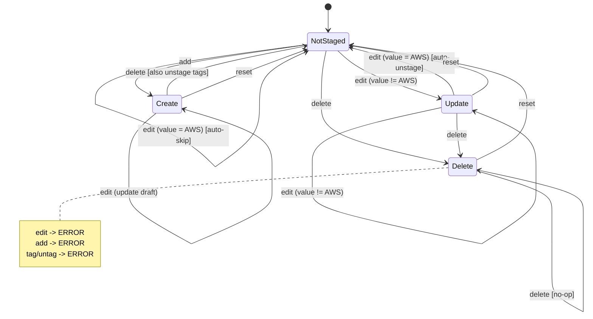
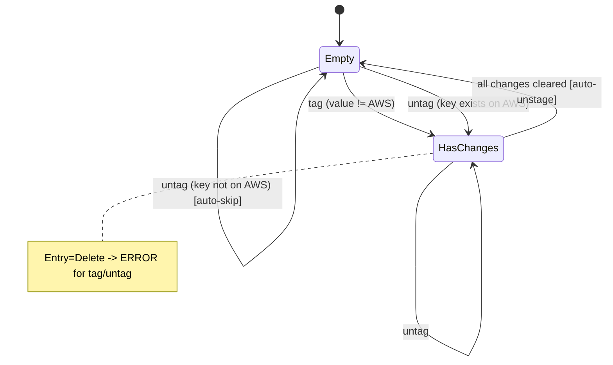

# Staging State Transitions

> [Back to README](../README.md#staging-workflow)

This document describes the state machine that governs staging operations in suve. The staging system uses a Redux-like pattern with pure reducer functions for predictable state transitions.

## Overview

The staging system manages two types of state:
- **Entry State**: Tracks value changes (create/update/delete operations)
- **Tag State**: Tracks tag modifications (add/remove operations)

## Entry State Machine

### States

| State | Description |
|-------|-------------|
| `NotStaged` | No pending changes for this resource |
| `Create` | Resource will be created (doesn't exist in AWS) |
| `Update` | Resource value will be modified |
| `Delete` | Resource will be deleted |

### State Diagram



### Transition Rules

| Current State | Action | Condition | New State | Notes |
|---------------|--------|-----------|-----------|-------|
| NotStaged | `add` | - | Create | Stage new resource |
| NotStaged | `edit` | value != AWS | Update | Stage modification |
| NotStaged | `edit` | value = AWS | NotStaged | Auto-skip (no change needed) |
| NotStaged | `delete` | - | Delete | Stage deletion |
| Create | `add` | - | Create | Update draft value |
| Create | `edit` | - | Create | Update draft value |
| Create | `delete` | - | NotStaged | Unstage + discard tags |
| Create | `reset` | - | NotStaged | Unstage only |
| Update | `edit` | value != AWS | Update | Update draft value |
| Update | `edit` | value = AWS | NotStaged | Auto-unstage (reverted) |
| Update | `delete` | - | Delete | Convert to delete |
| Update | `reset` | - | NotStaged | Unstage |
| Delete | `edit` | - | **ERROR** | Must reset first |
| Delete | `add` | - | **ERROR** | Cannot add to delete-staged |
| Delete | `delete` | - | Delete | No-op |
| Delete | `reset` | - | NotStaged | Unstage |

### Special Behaviors

#### Auto-Skip
When editing a resource that is not staged, if the new value matches the current AWS value, the operation is skipped entirely (no staging occurs).

```
AWS value: "foo"
-> edit "foo" -> Skipped (same as AWS)
```

#### Auto-Unstage
When editing a staged resource, if the new value matches the current AWS value, the resource is automatically unstaged.

```
AWS value: "foo"
-> edit "bar" -> Update staged (value="bar")
-> edit "foo" -> Unstaged (reverted to AWS)
```

#### Tag Cascade on Create Delete
When a `Create`-staged resource is deleted (unstaged), any associated tag changes are also discarded. This prevents orphaned tag operations that would fail on apply.

```
-> add /app/new -> Create staged
-> tag env=prod -> Tags staged
-> delete /app/new -> Both entry and tags unstaged
```

## Tag State Machine

### States

| State | Description |
|-------|-------------|
| `Empty` | No pending tag changes |
| `HasChanges` | Has pending tag additions and/or removals |

### State Diagram



### Tag Change Tracking

Tags are tracked with two sets:
- **ToSet**: Tags to add or update (key-value pairs)
- **ToUnset**: Tag keys to remove

### Transition Rules

| Action | Condition | Result |
|--------|-----------|--------|
| `tag key=value` | key not in AWS or value differs | Add to ToSet |
| `tag key=value` | key in AWS with same value | Auto-skip |
| `tag key=value` | key in ToUnset | Remove from ToUnset, add to ToSet |
| `untag key` | key exists in AWS | Add to ToUnset |
| `untag key` | key not in AWS | Auto-skip |
| `untag key` | key in ToSet | Remove from ToSet, add to ToUnset if in AWS |

### Delete-Staged Restriction

Tag operations (`tag`/`untag`) are blocked when the entry is staged for deletion. This prevents meaningless tag changes on resources that will be deleted.

```
-> delete /app/config -> Delete staged
-> tag env=prod -> ERROR: cannot modify tags on delete-staged resource
```

## Conflict Detection

When applying changes, suve checks for conflicts by comparing the `BaseModifiedAt` timestamp (recorded at staging time) with the current AWS `LastModified` time.

| Operation | Conflict Condition |
|-----------|-------------------|
| Create | Resource now exists in AWS |
| Update | AWS modified after staging |
| Delete | AWS modified after staging |

Use `--ignore-conflicts` to force apply despite conflicts.

## Implementation

The state machine is implemented in `internal/staging/transition/`:

- `state.go`: State type definitions
- `action.go`: Action type definitions
- `reducer.go`: Pure reducer functions (`ReduceEntry`, `ReduceTag`)
- `executor.go`: Persists reducer results to the store

The reducer functions are pure (no side effects) and deterministic, making the staging behavior predictable and testable.
