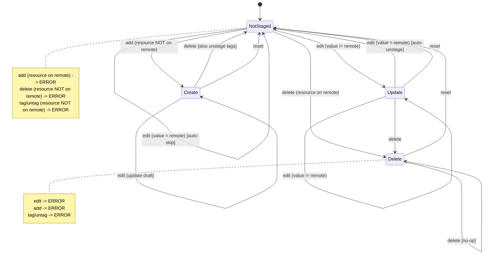
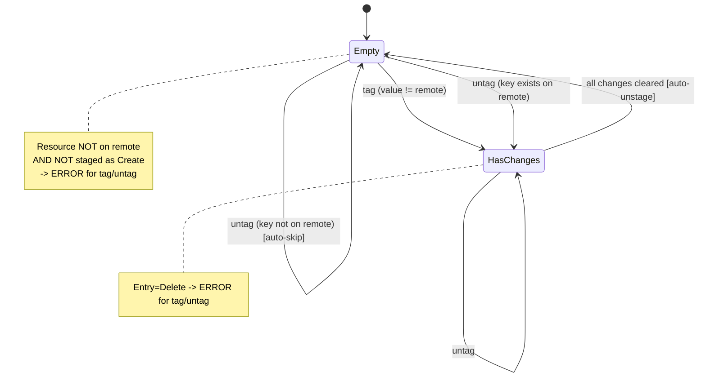

# Stage Lifecycle

> [Back to README](../README.md#staging-workflow)

This document describes the state machine that governs staging operations in suve. The staging system uses a Redux-like pattern with pure reducer functions for predictable state transitions.

## Overview

The staging system manages two types of state:
- **Entry State**: Tracks value changes (create/update/delete operations)
- **Tag State**: Tracks tag modifications (add/remove operations)

## Entry State Machine

### States

| State | Description |
|-------|-------------|
| `NotStaged` | No pending changes for this resource |
| `Create` | Resource will be created (doesn't exist on the remote) |
| `Update` | Resource value will be modified |
| `Delete` | Resource will be deleted |

### State Diagram


```mermaid
stateDiagram-v2
    [*] --> NotStaged

    NotStaged --> Create: add (resource NOT on remote)
    NotStaged --> Update: edit (value != remote)
    NotStaged --> NotStaged: edit (value = remote) [auto-skip]
    NotStaged --> Delete: delete (resource on remote)

    Create --> Create: add (update draft)
    Create --> Create: edit (update draft)
    Create --> NotStaged: delete [also unstage tags]
    Create --> NotStaged: reset

    Update --> Update: edit (value != remote)
    Update --> NotStaged: edit (value = remote) [auto-unstage]
    Update --> Delete: delete
    Update --> NotStaged: reset

    Delete --> NotStaged: reset
    Delete --> Delete: delete [no-op]

    note right of NotStaged
        add (resource on remote) -> ERROR
        delete (resource NOT on remote) -> ERROR
        tag/untag (resource NOT on remote) -> ERROR
    end note

    note right of Delete
        edit -> ERROR
        add -> ERROR
        tag/untag -> ERROR
    end note
```

### Transition Rules

| Current State | Action | Condition | New State | Notes |
|---------------|--------|-----------|-----------|-------|
| NotStaged | `add` | resource NOT on remote | Create | Stage new resource |
| NotStaged | `add` | resource on remote | **ERROR** | Use `edit` instead |
| NotStaged | `edit` | value != remote | Update | Stage modification |
| NotStaged | `edit` | value = remote | NotStaged | Auto-skip (no change needed) |
| NotStaged | `delete` | resource on remote | Delete | Stage deletion |
| NotStaged | `delete` | resource NOT on remote | **ERROR** | Resource doesn't exist |
| NotStaged | `tag/untag` | resource NOT on remote | **ERROR** | Resource doesn't exist |
| Create | `add` | - | Create | Update draft value |
| Create | `edit` | - | Create | Update draft value |
| Create | `delete` | - | NotStaged | Unstage + discard tags |
| Create | `reset` | - | NotStaged | Unstage only |
| Create | `tag/untag` | - | HasChanges | Tags apply on resource creation |
| Update | `edit` | value != remote | Update | Update draft value |
| Update | `edit` | value = remote | NotStaged | Auto-unstage (reverted) |
| Update | `delete` | - | Delete | Convert to delete |
| Update | `reset` | - | NotStaged | Unstage |
| Delete | `edit` | - | **ERROR** | Must reset first |
| Delete | `add` | - | **ERROR** | Cannot add to delete-staged |
| Delete | `delete` | - | Delete | No-op |
| Delete | `reset` | - | NotStaged | Unstage |

### Special Behaviors

#### Auto-Skip
When editing a resource that is not staged, if the new value matches the current remote value, the operation is skipped entirely (no staging occurs).

```
remote value: "foo"
-> edit "foo" -> Skipped (same as remote)
```

#### Auto-Unstage
When editing a staged resource, if the new value matches the current remote value, the resource is automatically unstaged.

```
remote value: "foo"
-> edit "bar" -> Update staged (value="bar")
-> edit "foo" -> Unstaged (reverted to remote)
```

#### Tag Cascade on Create Delete
When a `Create`-staged resource is deleted (unstaged), any associated tag changes are also discarded. This prevents orphaned tag operations that would fail on apply.

```
-> add /app/new -> Create staged
-> tag env=prod -> Tags staged
-> delete /app/new -> Both entry and tags unstaged
```

#### Resource Existence Checks
Before staging operations, suve validates that the resource state on the remote is compatible with the requested action:

| Action | Requirement | Error |
|--------|-------------|-------|
| `add` | Resource must NOT exist on the remote | "cannot add: resource already exists, use edit instead" |
| `delete` | Resource must exist on the remote (or be staged as Create) | "cannot delete: resource not found" |
| `tag/untag` | Resource must exist on the remote (or be staged as Create) | "cannot tag/untag: resource not found" |

This prevents common mistakes like:
```
-> add /app/existing   -> ERROR (resource exists, use edit)
-> delete /app/missing -> ERROR (resource not found)
-> tag /app/missing    -> ERROR (resource not found)
```

For staged `Create` resources, `delete` unstages instead of erroring, and `tag/untag` is allowed (tags will be applied when the resource is created).

## Tag State Machine

### States

| State | Description |
|-------|-------------|
| `Empty` | No pending tag changes |
| `HasChanges` | Has pending tag additions and/or removals |

### State Diagram


```mermaid
stateDiagram-v2
    [*] --> Empty

    Empty --> HasChanges: tag (value != remote)
    Empty --> Empty: tag (value = remote) [auto-skip]
    Empty --> HasChanges: untag (key exists on remote)
    Empty --> Empty: untag (key not on remote) [auto-skip]

    HasChanges --> HasChanges: tag (add/update)
    HasChanges --> HasChanges: untag
    HasChanges --> Empty: all changes cleared [auto-unstage]

    note right of Empty
        Resource NOT on remote
        AND NOT staged as Create
        -> ERROR for tag/untag
    end note

    note right of HasChanges
        Entry=Delete -> ERROR for tag/untag
    end note
```

### Tag Change Tracking

Tags are tracked with two sets:
- **ToSet**: Tags to add or update (key-value pairs)
- **ToUnset**: Tag keys to remove

### Transition Rules

| Action | Condition | Result |
|--------|-----------|--------|
| `tag key=value` | key not on remote or value differs | Add to ToSet |
| `tag key=value` | key on remote with same value | Auto-skip |
| `tag key=value` | key in ToUnset | Remove from ToUnset, add to ToSet |
| `untag key` | key exists on remote | Add to ToUnset |
| `untag key` | key not on remote | Auto-skip |
| `untag key` | key in ToSet | Remove from ToSet, add to ToUnset if on remote |

### Delete-Staged Restriction

Tag operations (`tag`/`untag`) are blocked when the entry is staged for deletion. This prevents meaningless tag changes on resources that will be deleted.

```
-> delete /app/config -> Delete staged
-> tag env=prod -> ERROR: cannot modify tags on delete-staged resource
```

## Conflict Detection

When applying changes, suve checks for conflicts by comparing the `BaseModifiedAt` timestamp (recorded at staging time) with the current remote `LastModified` time.

| Operation | Conflict Condition |
|-----------|-------------------|
| Create | Resource now exists on the remote |
| Update | Remote modified after staging |
| Delete | Remote modified after staging |

Use `--ignore-conflicts` to force apply despite conflicts.

> **Timestamp precision.** Update/Delete conflicts are detected only when the remote `LastModified` is *strictly after* the recorded `BaseModifiedAt`. On providers whose modified time is second-granular (notably Azure Key Vault), an out-of-band write that lands in the same wall-clock second as the recorded base compares as equal, so it is not flagged as a conflict and can be overwritten on apply. The window is narrow and inherent to the provider's timestamp precision.

## Implementation

The state machine is implemented in `internal/staging/transition/`:

- `state.go`: State type definitions
- `action.go`: Action type definitions
- `reducer.go`: Pure reducer functions (`ReduceEntry`, `ReduceTag`)
- `executor.go`: Persists reducer results to the store

The reducer functions are pure (no side effects) and deterministic, making the staging behavior predictable and testable.
